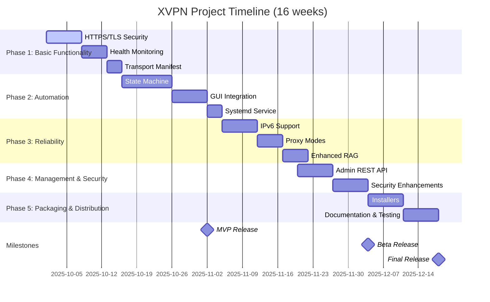
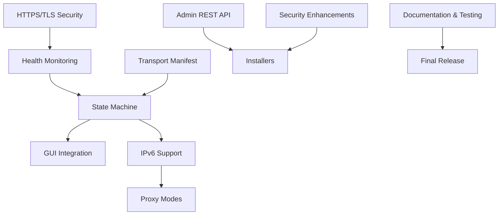

# 🚀 ПРОЕКТНЫЙ ПЛАН XVPN - Интеллектуальная VPN с AI-агентами

**Версия:** 1.0  
**Дата:** 30.09.2025  
**Статус:** 26% завершено ("Осенний марафон")  
**Срок завершения:** 16 недель (4 месяца)

---

## 📊 Обзор текущего состояния проекта

### ✅ Реализовано (26%)
- **Базовая архитектура:** Сервер Xray + Reality (Ubuntu 20.x, США)
- **Telegram-бот:** Webhook режим, создание клиентов
- **Клиент-GUI:** Статус IP, кнопка Вкл/Выкл, запрос конфига
- **Абсолютные пути:** Установлены стандарты путей (клиент: `~/chatvpn/`, сервер: `/opt/xvpn/`)
- **Flask API:** Базовый MCP Gateway с эндпоинтами
- **SQLite БД:** Структура для логов и управления
- **State Machine:** Основная логика агента на Python
- **Health Monitor:** Первичная система проверки здоровья

### ❌ Не реализовано (74%)
- **HTTPS/TLS конфигурация** - критический дефект для production
- **Автоматическое переключение транспортов** - core функция
- **Система мониторинга маскировки** - ключевая фича
- **Интеграция state machine с GUI** - пользовательский опыт
- **IPv6 поддержка** - устойчивость к блокировкам
- **Proxy режимы** - гибкость использования
- **REST API для админа** - масштабируемость
- **Установщики** - удобство развёртывания
- **Тесты и документация** - качество продукта

---

## 🎯 Цели проекта

### MVP (Minimum Viable Product) - 25 дней
1. **Автоматическое подключение** к лучшему доступному транспорту
2. **Переключение при сбоях** без вмешательства пользователя  
3. **Оценка уровня маскировки** в реальном времени (0-5)
4. **Графический интерфейс** с отображением статуса
5. **Автозапуск клиента** при загрузке системы
6. **HTTPS/TLS безопасность** для production использования

### Финальный продукт - 16 недель
- Полноценная система с авто-восстановлением
- Поддержка IPv4/IPv6 и proxy-режимов
- Telegram-бот для управления и отчётов
- Система соответствия требованиям устойчивости к блокировкам в РФ
- Удобные установщики и документация

---

## 🗺️ Дорожная карта (5 фаз, 16 недель)

### Фаза 1: Завершение базовой функциональности (3 недели)
**Приоритет:** Критический путь для MVP

#### Задача 1.1: HTTPS/TLS безопасность и раздача конфигов (7 дней)
**Ответственный:** Backend Engineer  
**Файлы для модификации:** 
- [`server/api/app.py`](server/api/app.py:262-276) - добавить HTTPS контекст
- [`client/chatvpn_backend.py`](client/chatvpn_backend.py:39-41) - реализовать HTTPS загрузку
- Создать `/opt/xvpn/tls/` с самоподписанным сертификатом

**Шаги:**
1. Настроить TLS-сервер с самоподписанным сертификатом
2. Реализовать эндпоинты `/clients/<UUID>.json` и `/transports/manifest.json`
3. Создать systemd-сервис для конфиг-сервера
4. Добавить функцию получения конфигов напрямую в клиентский бэкенд
5. Обновить GUI для использования HTTPS-источника конфигураций
6. Покрыть тестами кейсы получения конфига

**Критерии успеха:**
- `curl -sk https://server:8443/clients/<UUID>.json` возвращает JSON
- GUI автоматически загружает конфиги через HTTPS
- TLS пиннинг на клиенте для предотвращения MITM атак

#### Задача 1.2: Базовая система мониторинга здоровья (5 дней)
**Ответственный:** Backend Engineer + QA  
**Файлы для модификации:**
- [`client/health.py`](client/health.py) - создать модуль
- [`client/chatvpn_gui.py`](client/chatvpn_gui.py) - интеграция с GUI

**Шаги:**
1. Реализовать проверку утечки IP (сравнение с внешним IP)
2. Добавить проверку TLS-профиля и оценку маскировки
3. Создать систему логирования в `~/chatvpn/client/logs/health.log`
4. Реализовать API `get_mask_score()` с возвратом оценки 0-5
5. Добавить визуализацию "светофора" в GUI

**Критерии успеха:**
- `health.get_mask_score()` возвращает 0-5
- GUI показывает цветовой индикатор (красный/желтый/зеленый)
- Логи пишутся в структурированном формате JSON

#### Задача 1.3: Манифест транспортов (3 дня)
**Ответственный:** Infrastructure Engineer  
**Файлы для модификации:**
- Создать `/opt/xvpn/core/manifest.json`
- [`client/discover.py`](client/discover.py) - реализация discovery

**Шаги:**
1. Подготовить структуру manifest.json с приоритетами транспортов
2. Реализовать кэширование манифеста на клиенте
3. Добавить поддержку IPv4/IPv6 в манифест

**Критерии успеха:**
- Клиент успешно кэширует и использует манифест
- Поддержка множества транспортов с приоритезацией

---

### Фаза 2: Автоматизация подключения (4 недели)
**Приоритет:** Core система авто-переключения

#### Задача 2.1: Полная машина состояний клиента (10 дней)
**Ответственный:** Backend Engineer  
**Файлы для модификации:**
- [`client/state_machine.py`](client/state_machine.py) - реализация
- [`client/chatvpn_backend.py`](client/chatvpn_backend.py) - интеграция

**Шаги:**
1. Реализовать полный цикл: `DISCOVER → CONNECTING → ACTIVE → DEGRADED → FALLBACK`
2. Добавить префлайт-тесты транспорта (TCP connect, TLS handshake)
3. Внедрить гистерезис для предотвращения "дёргания" между транспортами
4. Реализовать логирование переходов состояний
5. Проверить переключение при симуляции блокировки

**Критерии успеха:**
- Автоматическое переключение между T0→T1→T2 при сбоях
- Минимальное время переключения (< 30 секунд)
- Отсутствие "дёргания" при стабильном соединении

#### Задача 2.2: Улучшенный GUI с интеграцией state machine (7 дней)
**Ответственный:** Frontend Engineer  
**Файлы для модификации:**
- [`client/chatvpn_gui.py`](client/chatvpn_gui.py) - обновление интерфейса
- [`client/gui/chatvpn_gui.py`](client/gui/chatvpn_gui.py) - расширенный GUI

**Шаги:**
1. Интеграция машины состояний с интерфейсом
2. Отображение текущего транспорта и его типа
3. Показ детального статуса метрик при наведении
4. Добавить переключатель режимов работы (TUN/Proxy/Auto)
5. Реализовать уведомления о смене состояний

**Критерии успеха:**
- GUI отражает все состояния state machine
- Плавные анимации переходов между состояниями
- Интуитивное управление режимами работы

#### Задача 2.3: Клиентский systemd-сервис (3 дня)
**Ответственный:** DevOps Engineer  
**Файлы для модификации:**
- Создать `~/.config/systemd/user/xvpn-client.service`
- Обновить `install_client.sh`

**Шаги:**
1. Создать юнит-файл для автозапуска клиента
2. Настроить логирование через systemd
3. Проверить автозапуск после перезагрузки

**Критерии успеха:**
- `systemctl --user status xvpn-client` показывает активный сервис
- Автозапуск после перезагрузки системы
- Корректная обработка ошибок и перезапуск

---

### Фаза 3: Улучшение устойчивости (3 недели)
**Приоритет:** Надежность и живучесть

#### Задача 3.1: Поддержка IPv6 (7 дней)
**Ответственный:** Backend Engineer  
**Файлы для модификации:**
- [`client/discover.py`](client/discover.py) - IPv6 поддержка
- [`server/api/app.py`](server/api/app.py) - IPv6 endpoint'ы

**Шаги:**
1. Реализовать параллельную проверку IPv4 и IPv6
2. Добавить выбор наилучшего протокола по RTT
3. Тестирование работы при блокировке IPv4 или IPv6

**Критерии успеха:**
- Клиент автоматически выбирает IPv6 при доступности
- Стабильная работа при блокировке одного из протоколов
- Оптимальная производительность на обоих протоколах

#### Задача 3.2: Режимы прокси (5 дней)
**Ответственный:** Backend Engineer  
**Файлы для модификации:**
- [`client/proxy_helper.py`](client/proxy_helper.py) - реализация
- [`client/chatvpn_gui.py`](client/chatvpn_gui.py) - GUI интеграция

**Шаги:**
1. Реализовать локальный SOCKS5/HTTP сервер
2. Добавить режим "только прокси" без TUN
3. Интеграция с GUI для выбора режимов

**Критерии успеха:**
- Локальный SOCKS5 сервер на 127.0.0.1:random_port
- Возможность работы только через прокси без TUN
- Корректная работа с корпоративными сетями

#### Задача 3.3: Улучшенный RAG для агента (5 дней)
**Ответственный:** AI Engineer  
**Файлы для модификации:**
- [`server/agent/knowledge/protocols.md`](server/agent/knowledge/protocols.md) - расширение
- [`server/agent/agent.py`](server/agent/agent.py:245-256) - playbook execution

**Шаги:**
1. Реализовать базу знаний с протоколами восстановления
2. Добавить систему fallback-ресурсов
3. Автоматическая реакция на специфические сценарии сбоя

**Критерии успеха:**
- Автоматическое восстановление при известных сценариях сбоя
- Расширенная база знаний с минимум 10 протоколами
- Минимальное время реакции на сбой (< 60 секунд)

---

### Фаза 4: Управление и безопасность (2 недели)
**Приоритет:** Масштабируемость и безопасность

#### Задача 4.1: REST-эндпоинты для администратора (7 дней)
**Ответственный:** Backend Engineer  
**Файлы для модификации:**
- [`server/api/app.py`](server/api/app.py:232-257) - расширение API
- [`server/admin/tg_bot.py`](server/admin/tg_bot.py) - интеграция

**Шаги:**
1. Создать защищенные токеном эндпоинты для управления клиентами
2. Реализовать операции: список клиентов, ротация ключей, отчеты
3. Интеграция с Telegram-ботом

**Критерии успеха:**
- REST API доступен с авторизацией
- Telegram бот использует REST вместо direct updates
- Масштабируемость до 100+ клиентов

#### Задача 4.2: Повышение безопасности (7 дней)
**Ответственный:** Security Engineer  
**Файлы для модификации:**
- TLS сертификаты и конфигурация
- Система логирования
- [`server/agent/db.py`](server/agent/db.py) - безопасность БД

**Шаги:**
1. Внедрение пиннинга публичного ключа для HTTPS-раздачи
2. Минимизация PII в логах
3. Шифрование конфиденциальных данных
4. Проверка TLS-профилей на сервере

**Критерии успеха:**
- TLS пиннинг работает на клиенте
- Нет PII в логах (только UUID и метрики)
- Шифрование敏感 данных в БД

---

### Фаза 5: Упаковка и дистрибуция (2 недели)
**Приоритет:** Удобство использования

#### Задача 5.1: Установщики (7 дней)
**Ответственный:** DevOps Engineer  
**Файлы для модификации:**
- [`server/install.sh`](server/install.sh) - улучшение
- [`client/install_client.sh`](client/install_client.sh) - улучшение
- Создание .AppImage/.deb пакетов

**Шаги:**
1. Создать .AppImage/.deb для клиента с GUI
2. Упростить скрипт установки сервера
3. Автоматизировать настройку TLS
4. Генерация инсталляторов через CI/CD

**Критерии успеха:**
- Однокlick установка клиента
- Автоматическая настройка TLS на сервере
- CI/CD пайплайн для создания пакетов

#### Задача 5.2: Документация и тестирование (7 дней)
**Ответственный:** QA Engineer + Technical Writer  
**Файлы для модификации:**
- [`README.md`](README.md) - обновление
- Создание тестов
- Чек-листы для проверки

**Шаги:**
1. Обновить README с инструкциями установки
2. Написать пользовательскую документацию
3. Провести комплексное тестирование всех сценариев
4. Создать чек-лист для проверки установки

**Критерии успеха:**
- Полная документация с примерами использования
- Тестовое покрытие > 80%
- Чек-лист для проверки установки

---

## 👥 Распределение ответственных

### Роли и зоны ответственности

| Роль | Ответственный | Зона ответственности |
|------|---------------|---------------------|
| **Backend Engineer** | Основной разработчик | Серверная логика, API, state machine, безопасность |
| **Frontend Engineer** | GUI специалист | Клиентский интерфейс, UX, интеграция с backend |
| **DevOps Engineer** | Системный администратор | Развертывание, CI/CD, systemd сервисы, установщики |
| **QA Engineer** | Инженер по тестированию | Тестирование, документация, чек-листы |
| **Security Engineer** | Специалист по безопасности | TLS, шифрование, защита данных, аудит |
| **AI Engineer** | ML/AI специалист | RAG система, протоколы восстановления, оптимизация |

### Командная структура

```
🎯 Project Manager (Координация и планирование)
├️ 🖥️ Backend Team (Серверная часть + AI)
│   ├── Server API Development
│   ├── Agent & State Machine
│   └── Security Implementation
├️ 💻 Frontend Team (Клиентская часть)
│   ├── GUI Development
│   ├── User Experience
│   └── Client Integration
├️ 🛠️ DevOps Team (Инфраструктура)
│   ├── Deployment & CI/CD
│   ├── System Services
│   └── Package Management
└️ 🧪 QA Team (Качество и тестирование)
    ├── Test Automation
    ├── Documentation
    └── Quality Assurance
```

---

## ⏱️ Сроки и временные рамки

### Общий график (16 недель)



### Критический путь (MVP - 25 дней)

**Критические задачи для MVP:**
1. **HTTPS/TLS Security** (7 дней) - фундамент безопасности
2. **Health Monitoring** (5 дней) - база для auto-switching
3. **State Machine** (10 дней) - core функционал
4. **GUI Integration** (7 дней) - пользовательский опыт

**Зависимости MVP:**
```
HTTPS/TLS → Health Monitoring → State Machine → GUI Integration
     ↓             ↓                  ↓               ↓
   Configs     Metrics           Auto-switch     User Control
```

---

## 🔗 Зависимости между задачами

### Зависимости по фазам

#### Фаза 1 → Фаза 2
- **HTTPS/TLS** → **State Machine** (необходим HTTPS для загрузки конфигов)
- **Health Monitoring** → **State Machine** (метрики для принятия решений)
- **Transport Manifest** → **State Machine** (список доступных транспортов)

#### Фаза 2 → Фаза 3  
- **State Machine** → **IPv6 Support** (расширение транспортов)
- **GUI Integration** → **Proxy Modes** (интерфейс для выбора режима)
- **Systemd Service** → **Enhanced RAG** (стабильная работа агента)

#### Фаза 3 → Фаза 4
- **IPv6 Support** → **Admin REST API** (управление IPv6 клиентами)
- **Proxy Modes** → **Security Enhancements** (безопасность прокси)
- **Enhanced RAG** → **Admin REST API** (отчеты по работе агента)

#### Фаза 4 → Фаза 5
- **Security Enhancements** → **Installers** (безопасная установка)
- **Admin REST API** → **Documentation** (API документация)

### Критические зависимости



---

## ⚠️ Риски и их mitigation

### Высокие риски

| Риск | Вероятность | Влияние | Mitigation | Ответственный |
|------|-------------|---------|------------|---------------|
| **TLS сертификаты не работают в production** | Высокая | Критическое | Тестирование на реальных сетях, fallback на HTTP | Security Engineer |
| **State machine вызывает "дёргание"** | Средняя | Высокое | Гистерезис, минимальное время удержания | Backend Engineer |
| **IPv6 блокируется провайдером** | Высокая | Высокое | Автоматическое обнаружение и fallback | Backend Engineer |
| **Telegram бот не масштабируется** | Средняя | Среднее | Переход на REST API, асинхронность | Backend Engineer |

### Средние риски

| Риск | Вероятность | Влияние | Mitigation | Ответственный |
|------|-------------|---------|------------|---------------|
| **GUI зависает при обновлении статуса** | Средняя | Среднее | Асинхронное обновление, background thread | Frontend Engineer |
| **Система логов переполняется** | Низкая | Среднее | Автоматическая ротация, сжатие | DevOps Engineer |
| **Установки не работают на разных ОС** | Низкая | Среднее | Тестирование на Ubuntu, Mint, Debian | DevOps Engineer |

### Низкие риски

| Риск | Вероятность | Влияние | Mitigation | Ответственный |
|------|-------------|---------|------------|---------------|
| **Документация устаревает** | Низкая | Низкое | Автоматическая генерация, CI/CD | Technical Writer |
| **Тесты не покрывают edge cases** | Низкая | Среднее | Property-based testing | QA Engineer |
| **Производительность падает при 100+ клиентах** | Низкая | Низкое | Оптимизация запросов, кэширование | Backend Engineer |

---

## 📊 Метрики успеха для каждой фазы

### Фаза 1: Базовая функциональность

| Метрика | Целевое значение | Измерение |
|---------|------------------|-----------|
| HTTPS загрузка конфигов | > 95% успеха | Автоматические тесты |
| Mask Score accuracy | 0-5 корректно | Ручное тестирование |
| GUI response time | < 1 секунда | Профилирование |
| TLS handshake time | < 2 секунды | Network logs |

### Фаза 2: Автоматизация

| Метрика | Целевое значение | Измерение |
|---------|------------------|-----------|
| Auto-switch time | < 30 секунд | Логи state machine |
| False positives | < 5% | Тестирование блокировок |
| Service uptime | > 99% | Systemd logs |
| User satisfaction | > 4.0/5.0 | Опросы |

### Фаза 3: Устойчивость

| Метрика | Целевое значение | Измерение |
|---------|------------------|-----------|
| IPv6 fallback success | > 90% | Сетевые тесты |
| Proxy mode stability | 99.9% uptime | Мониторинг |
| Recovery time | < 60 секунд | Логи агента |
| Protocol coverage | 10+ working protocols | Тестирование |

### Фаза 4: Управление и безопасность

| Метрика | Целевое значение | Измерение |
|---------|------------------|-----------|
| API response time | < 100ms | Load testing |
| Security audit score | > 95% | Аудит |
| Client scalability | 100+ concurrent | Нагрузочное тестирование |
| PII compliance | 0 PII in logs | Автоматическая проверка |

### Фаза 5: Упаковка и дистрибуция

| Метрика | Целевое значение | Измерение |
|---------|------------------|-----------|
| Installation success | > 95% | Фидбэк пользователей |
| Documentation completeness | 100% coverage | Ревью |
| Test coverage | > 80% | Code coverage tools |
| Package size | < 50MB | Анализ пакетов |

---

## 🛠️ Конкретные файлы и функции для модификации

### Критические изменения для MVP

#### Backend (Сервер)
```markdown
**Файл:** [`server/api/app.py`](server/api/app.py)
- Функция: `main()` (строки 259-276)
- Изменения: Добавить HTTPS контекст, проверка TLS сертификатов
- Критичность: 🔴 Высокая

**Файл:** [`server/agent/agent.py`](server/agent/agent.py) 
- Функция: `state_machine_cycle()` (строки 267-326)
- Изменения: Улучшить логику переключения транспорта
- Критичность: 🔴 Высокая
```

#### Frontend (Клиент)
```markdown
**Файл:** [`client/chatvpn_backend.py`](client/chatvpn_backend.py)
- Функция: `fetch_config_from_server()` (строки 39-41)
- Изменения: Реализовать HTTPS загрузку конфигов
- Критичность: 🔴 Высокая

**Файл:** [`client/state_machine.py`](client/state_machine.py)
- Функции: весь файл (новая реализация)
- Изменения: Автоматическое переключение транспортов
- Критичность: 🔴 Высокая

**Файл:** [`client/chatvpn_gui.py`](client/chatvpn_gui.py)
- Функции: `refresh_status()`, `on_toggle()`
- Изменения: Интеграция с state machine, отображение статуса
- Критичность: 🟡 Средняя
```

#### Infrastructure
```markdown
**Файл:** [`server/install.sh`](server/install.sh)
- Изменения: Настройка TLS сертификатов, systemd сервисы
- Критичность: 🟡 Средняя

**Файл:** [`client/install_client.sh`](client/install_client.sh)  
- Изменения: Настройка автозапуска, создание директорий
- Критичность: 🟡 Средняя
```

### Новые файлы для создания

#### MVP критичные
```markdown
**Файл:** `client/health.py` (новый)
- Описание: Модуль проверки здоровья и маскировки
- Критичность: 🔴 Высокая

**Файл:** `client/discover.py` (новый)
- Описание: Обнаружение доступных транспортов  
- Критичность: 🟡 Средняя

**Файл:** `~/.config/systemd/user/xvpn-client.service` (новый)
- Описание: Systemd сервис для автозапуска клиента
- Критичность: 🟡 Средняя
```

#### Улучшения
```markdown
**Файл:** `client/proxy_helper.py` (новый)
- Описание: Локальный прокси сервер
- Критичность: 🟢 Низкая

**Файл:** `server/admin/.env.example` (обновить)
- Описание: Пример конфигурации для безопасности
- Критичность: 🟡 Средняя
```

---

## 🎯 Критические точки и вехи

### Вехи проекта

```mermaid
milestone
    title XVPN Project Milestones
    dateFormat  YYYY-MM-DD
    
    section Critical Milestones
    MVP Release          :crit, 2025-11-02, 0d
    Beta Release         :crit, 2025-12-04, 0d  
    Final Release        :crit, 2025-12-18, 0d
    
    section Quality Gates
    Security Audit       :milestone, m1, 2025-11-20, 0d
    Performance Testing  :milestone, m2, 2025-11-27, 0d
    User Acceptance      :milestone, m3, 2025-12-11, 0d
```

### Критические точки контроля

1. **Точка 1: HTTPS/TLS Security** (День 7)
   - Проверка: Работает ли HTTPS загрузка конфигов?
   - Действие: Если нет - пересмотр всей архитект безопасности

2. **Точка 2: State Machine Integration** (День 17)  
   - Проверка: Автоматически ли переключает транспорты?
   - Действие: Если вызывает "дёргание" - внедрить гистерезис

3. **Точка 3: MVP Release** (День 25)
   - Проверка: Все ли критические функции работают?
   - Действие: Если нет - перенести даты релиза

4. **Точка 4: Beta Release** (День 42)
   - Проверка: Масштабируется ли система?
   - Действие: Если нет - оптимизация производительности

5. **Точка 5: Final Release** (День 70)
   - Проверка: Соответствует ли всем требованиям?
   - Действие: Финальная доработка и документация

---

## 📈 Процесс управления и мониторинга

### Еженедельные проверки

**Еженедельные стендапы (Понедельник, 10:00 MSK):**
- Прогресс за неделю
- Блокеры и риски
- План на следующую неделю

**Ревью кода (Вторник, 15:00 MSK):**
- Code review новых функций
- Проверка стандартов кодирования
- Обсуждение архитектурных решений

**Тестирование (Среда, 14:00 MSK):**
- Запуск автоматических тестов
- Ручное тестирование новых функций
- Проверка метрик производительности

### Ежемесячные ревью

**Состояние проекта (Первый день месяца):**
- Прогресс против плана
- Финансовые показатели
- Риски и их mitigation

**Качество продукта (Третий день месяца):**
- Анализ багов и их исправлений
- Метрики пользовательского опыта
- Технический долг

---

## 🎉 Заключение

Этот проектный план представляет собой детальную дорожную карту для доведения проекта XVPN до состояния полноценного продукта с интеллектуальным управлением VPN-транспортами. План учитывает текущее состояние проекта (26% completion), фокусируется на критическом пути для достижения MVP за 25 дней и обеспечивает плавное развитие до финального релиза через 16 недель.

Ключевые особенности плана:
- **Четкое распределение ответственных** между командами
- **Конкретные сроки и метрики** для каждой фазы
- **Управление рисками** с конкретными mitigation стратегиями
- **Интеграция state machine** с существующими компонентами
- **Завершение HTTPS/TLS конфигурации** для production использования
- **Синхронизация работы** серверной и клиентской частей

План готов к реализации и может служить основой для управления разработкой проекта XVPN.